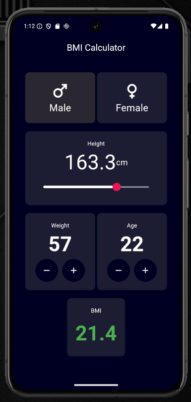

# BMI Calculator Flutter App

A simple and responsive BMI (Body Mass Index) Calculator built with Flutter.

## Features

- Select Gender (Male / Female)
- Adjust Height using Slider
- Increase / Decrease Weight
- Increase / Decrease Age
- Real-time BMI Calculation
- Color-coded BMI Results
  - 🔵 Underweight
  - 🟢 Normal Weight
  - 🟠 Overweight
  - 🔴 Obesity
- Clean and Modern UI

---

## Screenshots

### Application




---

## BMI Categories

| BMI Range | Category |
|------------|----------|
| Less than 18.5 | Underweight |
| 18.5 - 24.9 | Normal Weight |
| 25.0 - 29.9 | Overweight |
| 30.0 and above | Obesity |

---

## Technologies Used

- Flutter
- Dart
- Material Design

---

## Project Structure

```text
lib/
├── main.dart
├── bmi_calculator_page.dart
├── gender_tile_widget.dart
└── constant.dart
```

---

## How BMI is Calculated

```dart
double calculateBMI({
  required int weight,
  required double height,
}) {
  double heightInMeters = height / 100;
  return weight / (heightInMeters * heightInMeters);
}
```

Formula:

BMI = Weight (kg) / Height² (m²)

---

## Getting Started

### Clone the repository

```bash
git clone https://github.com/thishanherath/BMI-Calculator-Flutter.git
```

### Navigate to project folder

```bash
cd flutter-bmi-calculator
```

### Install dependencies

```bash
flutter pub get
```

### Run the project

```bash
flutter run
```

---

## Author

Developed by Thishan Herath

GitHub: https://github.com/thishanherath

---